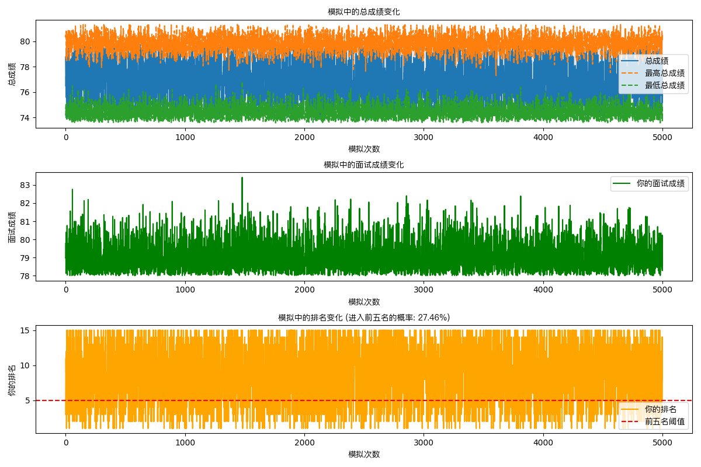

# interview_predictor
模拟随机生成符合正态分布的成绩，统计随机结果和是否进入topN。

## curl demo
```shell
 curl -X POST http://localhost:8080/simulate -d '{
  "exam_score": 72.47,
  "other_exam_scores": [71.32, 70.44, 69.34, 69.10, 68.79, 68.55, 68.51, 67.79, 67.38, 67.22, 67.13, 67.11, 67.00, 66.93],
  "simulations": 5000,
  "top_n": 5,
  "average": 83.0,
  "stddev": 4.0,
  "min": 78,
  "max": 88
}' > /tmp/rank.json
```

## 绘制图表
```python
python3 plt.py
```

## 效果
